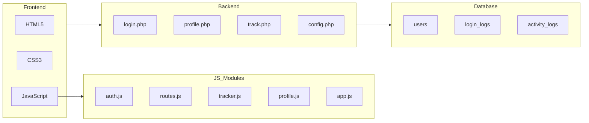

<div align="center">


<br/>


<br/><br/>

---

### -- Live Website এ Visit করুন | Click to Open --

<a href="https://premier-university-problem-sover.netlify.app/" target="_blank">
  
</a>

<br/><br/>

### -- GitHub Source Code দেখুন | View Repository --

<a href="https://github.com/rahul-3613/Puc-Problem-Sover" target="_blank">
  
</a>

<br/><br/>

---

<p>


</p>

<p>


</p>

</div>

---

## প্রজেক্ট সম্পর্কে | About The Project

**PUC HUB** হলো Premier University Chittagong-এর শিক্ষার্থীদের জন্য তৈরি একটি সম্পূর্ণ Student Portal। Internet Programming Lab-এর প্রজেক্ট হিসেবে Team PUC HUB এটি তৈরি করেছে। এক জায়গায় AI Tools, Routine, Faculty Contact, Fee Calculator, Blood Donation এবং আরো ৩০+ ফিচার পাওয়া যায়।

```
  University  |  Premier University Chittagong
  Project     |  Internet Programming Lab — Semester Project 2024
  Features    |  30+ Services, AI Powered, Mobile Friendly
  Team        |  Rahul, Alvi, Ador, Rudra ,Tabib
```

---

## সার্ভিস ওভারভিউ | Services Overview

```mermaid
graph TD
    A[PUC HUB] --> B[PREMIUM]
    A --> C[STANDARD]
    A --> D[GENERAL]
    A --> E[NORMAL]
    A --> F[AI TOOLS]

    B --> B1[Question Bank]
    B --> B2[PUC AI Assistant]
    B --> B3[Cover Page Generator]
    B --> B4[Blood Donation]
    B --> B5[CP Leaderboard]
    B --> B6[Routine Generator]

    C --> C1[Mess and Housing]
    C --> C2[Fee Calculator]
    C --> C3[Faculty Contacts]
    C --> C4[CGPA Calculator]
    C --> C5[Holiday Calendar]

    D --> D1[Class Routine]
    D --> D2[Exam Routine]
    D --> D3[Notice Board]
    D --> D4[Club Information]
    D --> D5[Bus Route Map]

    E --> E1[Study Partner Finder]
    E --> E2[University Room Info]
    E --> E3[YouTube Playlists]
    E --> E4[Learning Resources]

    F --> F1[AI Study Tracker]
    F --> F2[Notes Summarizer]
    F --> F3[Code Debugger]
    F --> F4[Assignment Writer]

    style A fill:#f39c12,color:#000,stroke:#e67e22
    style B fill:#3498db,color:#fff,stroke:#2980b9
    style C fill:#1abc9c,color:#fff,stroke:#16a085
    style D fill:#95a5a6,color:#fff,stroke:#7f8c8d
    style E fill:#27ae60,color:#fff,stroke:#229954
    style F fill:#9b59b6,color:#fff,stroke:#8e44ad
```



---

## সম্পূর্ণ সার্ভিস লিস্ট | Complete Service List

**Premium Services**

| Service | বিবরণ |
|---------|--------|
| Question Bank | পুরানো প্রশ্নপত্রের সম্পূর্ণ Archive |
| PUC AI Assistant | AI-চালিত Study Helper |
| Cover Page Generator | Lab Report-এর Cover Page তৈরি |
| Blood Donation | Emergency Blood Donor Network |
| CP Leaderboard | Codeforces PUC Ranking |
| Routine Generator | Custom Study Planner |

**Standard Services**

| Service | বিবরণ |
|---------|--------|
| Fee Calculator | Semester ফি হিসাব করুন |
| CGPA Calculator | CGPA গণনাকারী |
| Faculty Contacts | শিক্ষক ও CR যোগাযোগ তালিকা |
| Mess and Housing | আবাসন তথ্য |
| Holiday Calendar | ছুটির Calendar (PDF) |
| Bus Route Map | University বাসের Route |

**AI-Powered Tools**

| Tool | বিবরণ |
|------|--------|
| AI Study Tracker | পড়াশোনার Progress Track করুন |
| AI Notes Summarizer | Notes স্বয়ংক্রিয়ভাবে Summary করুন |
| Code Debugger | Code Error খুঁজে বের করুন |
| AI Assignment Writer | Assignment লেখায় AI সহায়তা |

---

## Tech Architecture



---

## ফাইল স্ট্রাকচার | File Structure

```
puc-hub/
|-- index.html              # Main Homepage
|-- login.html              # Login Page
|-- profile.html            # Profile Page
|-- history.html            # Activity History
|-- examroutine.html        # Exam Routine Viewer
|-- classroutine.html       # Class Routine Viewer
|-- faculty.html            # Teacher List
|-- holiday.html            # Holiday Calendar
|-- fee-calculator.html     # Fee Calculator
|-- Coverpages.html         # Cover Page Generator
|
|-- js/
|   |-- auth.js             # Authentication System
|   |-- routes.js           # Page Routing
|   |-- tracker.js          # User Activity Tracker
|   |-- profile.js          # Profile Management
|   `-- app.js              # Main App Functions
|
|-- api/
|   |-- config.php          # Database Config
|   |-- login.php           # Login Handler
|   |-- profile.php         # Profile Update
|   |-- track.php           # Page Visit Tracker
|   `-- test.php            # DB Connection Test
|
|-- assets/                 # PDF Files, Images, Icons
`-- puc_hub.sql             # Database Schema
```

---

## ইনস্টলেশন | Installation Guide

**Prerequisites**
```
XAMPP / WAMP / LAMP Server
PHP 7.4+
MySQL 5.7+
Modern Web Browser
```

**Step-by-step Setup**

```bash
# Step 1 — Clone করুন
git clone https://github.com/rahul-3613/Puc-Problem-Sover.git

# Step 2 — XAMPP htdocs-এ রাখুন
# C:\xampp\htdocs\puc_hub\

# Step 3 — Database Import করুন (phpMyAdmin)
SOURCE puc_hub.sql;

# Step 4 — Browser-এ চালু করুন
# http://localhost/puc_hub/
```

**config.php আপডেট করুন**
```php
define('DB_HOST', 'localhost');
define('DB_USER', 'root');
define('DB_PASS', '');
define('DB_NAME', 'puc_hub');
```

> Warning: Default admin password হলো `password` — প্রথম Login-এর পরেই পরিবর্তন করুন।

---

## Database Schema

```sql
CREATE TABLE users (
    id               INT AUTO_INCREMENT PRIMARY KEY,
    username         VARCHAR(100),
    student_id       VARCHAR(20) UNIQUE,   -- 15 digits
    password_hash    VARCHAR(255),          -- bcrypt
    department       VARCHAR(100),
    semester         VARCHAR(20),
    section          VARCHAR(10),
    blood_group      VARCHAR(5),
    advisor          VARCHAR(100),
    profile_image    TEXT,
    profile_completed TINYINT(1) DEFAULT 0,
    is_admin         TINYINT(1) DEFAULT 0,
    is_blocked       TINYINT(1) DEFAULT 0,
    created_at       DATETIME DEFAULT CURRENT_TIMESTAMP,
    last_login       DATETIME
);
```

---

## Design System

| Element | Value |
|---------|-------|
| Font | Poppins — 300, 400, 600, 700, 800 |
| Primary Color | `#f39c12` Gold |
| Secondary Color | `#e67e22` Orange |
| Background | `#0c0908` Deep Dark |
| Card Background | `#2b180f` Rich Brown |
| Premium Badge | `#3498db` Blue |
| Standard Badge | `#1abc9c` Teal |
| AI Tools Badge | `#9b59b6` Violet |

---

## Team PUC HUB

```
 TEAM PUC HUB — Internet Programming Lab Project 2024
 -------------------------------------------------------
  Rahul   --  Lead Dev, auth.js, routes.js, tracker.js, app.js, PHP, SQL
  Alvi    --  examroutine.html, classroutine.html, holiday.html
  Ador    --  faculty.html, UI Components and Design
  Rudra   --  profile.js, Image Compression and Upload System
```

---

## Key Features

| Feature | Details |
|---------|---------|
| Secure Auth | bcrypt hashing + 15-digit Student ID verification |
| Mobile Ready | PDF fallback for mobile, responsive UI |
| Dark Theme | Eye-friendly dark brown + amber color scheme |
| Activity Tracker | সব page visit localStorage + MySQL-এ track হয় |
| Image Compress | Profile image 300x300px-এ compress হয়ে save হয় |
| Exam Countdown | Real-time countdown to exam date |
| Auto Register | নতুন user স্বয়ংক্রিয়ভাবে register হয় |
| Admin Panel | Block/Unblock user, log monitor |
| PDF Viewer | Routine, Calendar সব PDF inline দেখা যায় |

---

